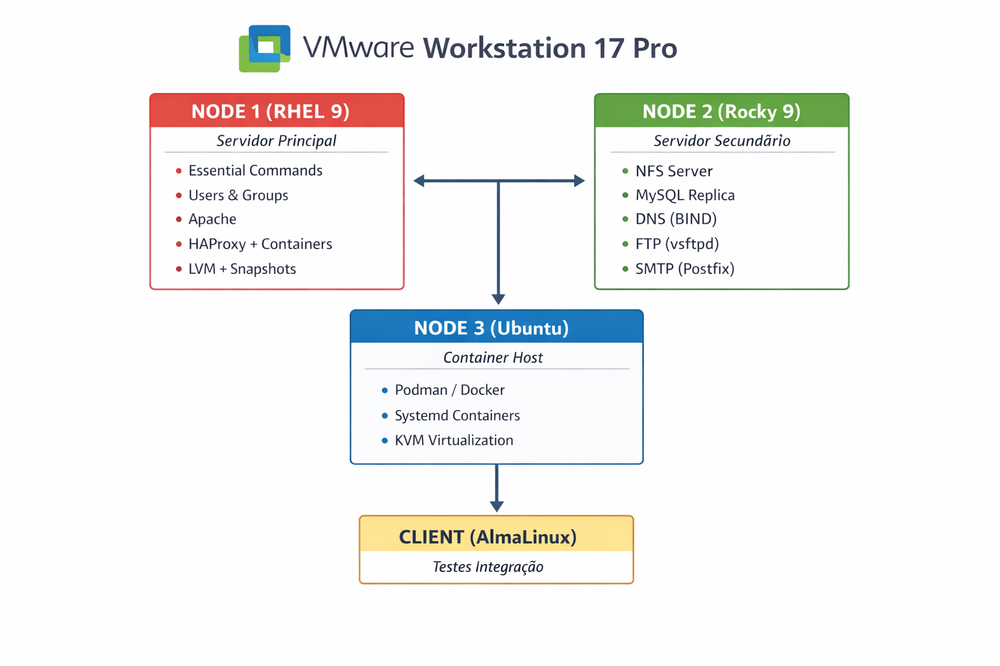

#  LFCS Complete System Administration Lab


## Sobre o Projeto

Este laboratório implementa uma **infraestrutura corporativa completa** com 4 máquinas virtuais, cobrindo **100% dos 5 domínios da certificação LFCS** (Linux Foundation Certified System Administrator).

A implementação do Node 1 foi reescrita de scripts bash manuais para Ansible
idempotente, com gestão de segredos via `ansible-vault` e testes declarativos
automatizados — ver [`node1-ansible/`](./node1-ansible) para detalhes técnicos
completos.

## Arquitetura do Ambiente



## Domínios LFCS Cobertos

| Domínio | Peso | Implementação |
|---------|------|---------------|
| **Essential Commands** | 20% | Node 1 - Wildcards, find, git, SSL |
| **Users & Groups** | 10% | Node 1 - ACLs, sudo, LDAP client |
| **Operations & Deployment** | 25% | Node 1 - Kernel tuning, systemd, SELinux |
| **Networking** | 25% | Node 1 - Bonding, HAProxy, firewall |
| **Storage** | 20% | Node 1 - LVM thin, snapshots |

## Estrutura do Repositório

```
lfcs-system-administration-lab/
├── README.md                  # este ficheiro
├── assets/                    # diagrama da arquitectura
├── node1/                     # v1: scripts bash manuais (histórico)
├── node1-ansible/             # v2: reescrita em Ansible idempotente ✅
│   ├── playbook.yml           # orquestra os 5 roles LFCS
│   ├── roles/                 # 1 role por domínio LFCS
│   └── tests/                 # validação declarativa pós-provisionamento
├── node2/                     # Rocky 9 — Em desenvolvimento
├── node3/                     # Ubuntu — Pendente
└── client/                    # AlmaLinux — Pendente
```

## Progresso Atual

- [x] **Node 1 (RHEL 9.8)** — Completo e validado (`ok=46 failed=0`, Ansible v2)
- [ ] **Node 2 (Rocky 9)** — Em desenvolvimento
- [ ] **Node 3 (Ubuntu 24.04)** — Pendente
- [ ] **Client (AlmaLinux 9)** — Pendente
- [ ] **Testes de Integração** — Pendente

## Autor

**António Thone**  
LFCS Certified Specialization (Pearson) | CCNA | Linux SysAdmin

[](https://linkedin.com/in/antónio-thone-6a761a255)
[](https://github.com/AntonioThone)
